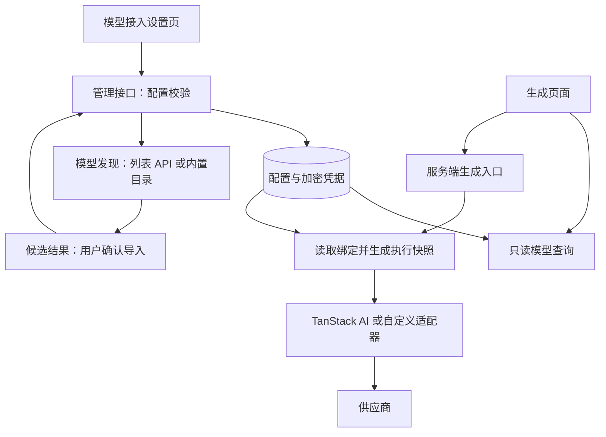

# 模型接入配置与发现技术方案

状态：第一版配置、发现、管理页面与生成接口已实现。图片工作台已接入模型／渠道选择与单张文生图；视频业务页面尚未接入。实际运行约束见[模型接入](../model-integration.md)。

## 1. 目标与决策

通过管理页面配置渠道、凭据与模型，让文本、生图、生视频等业务从同一个模型池获取可用模型。支持协议已接入的渠道通过配置扩展；新协议仍需实现适配器。

采用 TanStack AI 承担已有的模型调用、流式响应和媒体生成能力，保留 DashScope 图片等自定义适配。借鉴 Pi AI 的模型查询接口，不引入第二套 AI SDK。模型配置存入服务端 SQLite，由管理页面维护；代码只维护适配器、参数契约和首次初始化数据。

核心区分：

| 概念 | 含义 |
| --- | --- |
| 厂商 `vendor` | 模型研发方，例如 OpenAI、Alibaba |
| 渠道 `provider` | 一组接入配置，例如官方 OpenRouter、自建兼容服务；同一协议可有多个渠道实例 |
| 适配器 `adapter` | 代码实现的调用协议和请求映射，不是页面可填写的任意脚本 |
| 模型 `model` | 产品中的稳定模型身份，保存名称、厂商和输出类别 |
| 绑定 `binding` | 模型在某一渠道上的上游 ID、调用能力与参数配置 |
| 发现结果 | 上游或 SDK 提供的候选目录，不等于产品已启用的模型 |

模型分类与厂商、渠道彼此独立。保留现有 `kind: text | images | videos`，按能力筛选，不另外维护文本／图片／视频三份人工清单。同一模型允许多个渠道绑定，第一版显式选择绑定或使用唯一默认绑定，不做自动容灾、负载均衡或付费请求重提。

## 2. 当前实现与边界

当前实现见[模型接入](../model-integration.md)、[架构](../architecture.md)和[生成任务生命周期](../generation-lifecycle.md)。

- SQLite 配置是模型池的唯一运行来源；静态目录仅用于首次初始化和已支持媒体端点的契约校验。
- `/settings/models` 支持渠道、密钥、模型、绑定、默认绑定、停用、发现和明确导入。
- `GET /api/ai/models` 保留旧字段，增加安全绑定摘要与可提交状态；服务端查询支持类别、厂商、渠道筛选。
- 文本通过 TanStack AI 的动态 OpenAI-compatible 入口执行；媒体保留已接入协议。
- 图片／视频任务保存稳定业务意图与执行快照；重试先读取原记录，查询沿用原渠道与凭据。
- 新配置接口不要求应用令牌；现有生成接口保留 `AI_API_TOKEN`。

第一版按可信部署环境设计，不包含用户体系、登录、会话、角色权限、应用侧鉴权、团队、多租户、OAuth、计费、公开模型市场、后台自动同步、音频接入及新的图片／视频生成模式。供应商 API Key 仍是调用上游所需的接入凭据。

## 3. 调用与配置边界



浏览器只接收安全 DTO：名称、类别、能力、启用与配置状态。配置页面可查看 Base URL 与凭据元数据，密钥明文不回传。生成请求传模型 ID 和可选绑定 ID，不允许调用方直接传 Base URL、上游端点、凭据引用或自定义请求头。

不为了统一所有业务而增加通用任务引擎。现有文本、图片、视频入口继续分别执行，只共享目录查询、绑定解析和凭据读取。

## 4. 数据设计

继续使用现有 SQLite，各表用 JSON record 保存配置、绑定表另存外键与唯一约束字段，新增配置表并使用版本化迁移；SQL 留在 `src/models/server/db/`。第一版是部署级配置，不预建团队表或租户字段。

| 表 | 主要字段与约束 |
| --- | --- |
| `model_providers` | `id`、`name`、`enabled`、`baseUrl`、`credentialId`、`revision`；ID 稳定，名称不作为外键 |
| `model_credentials` | `id`、来源 `env / encrypted`、环境变量名称或密文／IV／认证标签、显示提示；绝不返回明文 |
| `model_catalog` | `id`、`name`、`vendor`、`kind`、`enabled`、可空 `defaultBindingId`、`revision` |
| `model_bindings` | `id`、`modelId`、`providerId`、`adapter`、`upstreamModelId`、`enabled`、能力和参数 JSON、`revision`；外键保证模型与渠道存在 |

渠道表达一组地址和认证配置；具体调用适配器放在绑定上，以便同一 DashScope 渠道同时支持文本兼容协议与原生图片协议。代码限制渠道地址／认证与适配器的合法组合；fal 等未实现自定义地址的适配器不显示地址编辑能力。

同一渠道、模型、适配器和上游 ID 不重复登记。`defaultBindingId` 必须属于当前模型，保存时在事务中校验。第一版不提供物理删除；可停用并显式另选默认或清空，不静默切换。

模型 ID 保持现有值，避免破坏请求和历史记录。同名模型不自动合并；导入时由用户选择创建模型或关联现有模型。不同渠道的同名模型版本、能力不一定相同。

### 能力放在绑定上

渠道可能只接入某模型的一部分功能，因此执行能力必须按绑定声明并校验。例如：

```ts
// 设计示例；不是当前已导出的类型。
type BindingCapabilities =
  | { kind: 'text' }
  | { kind: 'images'; aspectRatios: string[]; maxReferenceImages: number }
  | { kind: 'videos'; aspectRatios: string[]; durations: number[] }
```

初期只描述现有能力。参数 JSON 使用 Zod 结构校验，再按 `adapter` 校验类别与已支持端点能力，不能存放任意请求模板或脚本。图片尺寸映射、fal 特殊参数、提交／查询协议等仍由适配器实现。

“参考图编辑”等场景用真实能力筛选，不复制模型。模型聚合列表可展示能力摘要，但用户选定绑定后按该绑定能力渲染表单，服务端提交时再次校验。不能把多个绑定能力的并集当作某一条调用路线的能力。

### 配置与密钥更新

配置写入携带读取时的 `revision`，版本不匹配返回 409，防止页面覆盖他人修改。保存、关联和默认绑定更新在事务中执行。

密钥使用 Node `crypto` 的 AES-256-GCM，主密钥由服务端环境变量提供，和数据库分开保管；每次加密使用新随机 IV。缺少主密钥时禁止保存数据库密钥，但允许继续使用环境变量引用。更新表单中不提交密钥表示保留，第一版不提供凭据清除接口。

替换密钥创建新的凭据记录，已有任务仍引用旧凭据；不能假定新密钥属于同一供应商账号。旧凭据存在未结束任务引用时禁止清除。主密钥丢失会导致数据库凭据不可解密，部署备份需同时考虑数据库和主密钥；轮换需专门迁移，不能直接覆盖主密钥。

环境变量引用不能冻结其值：运维更改同名变量仍会影响旧任务。因此保留环境变量的部署必须在未结束任务期间保持原账号凭据；需要页面轮换并保留旧版本时，明确迁移到加密凭据存储，不暗中复制环境变量密钥。

## 5. 适配器与发现机制

第一版以现有调用能力为准：

| 绑定适配器 | 执行实现 | 模型发现策略 |
| --- | --- | --- |
| `openrouter-text` | TanStack `openaiCompatibleText` 动态入口 | 官方列表 API，仅导入明确支持文本输入／文本输出的候选 |
| `openai-compatible-text` | TanStack OpenAI-compatible；DashScope 保留专用参数映射 | 渠道明确支持列表 API 才允许同步，否则手动登记／初始化目录 |
| `dashscope-image` | 已有百炼原生图片实现 | 现有已接入目录与手动登记，受请求契约约束 |
| `fal-image`、`fal-video` | 已有 TanStack fal 适配器 | 内置目录仅现有已接入端点；新增不同参数契约的端点仍需代码适配 |

TanStack 的模型类型／内置列表是 SDK 能力依据，不是账户权限证明。数据库里的动态模型 ID 也不会自动成为 SDK 字面量类型：实现时必须使用正式支持的动态入口或在适配器边界校验转换；需要代码生成才能支持的目录，第一版仍限制为已接入集合，不以 `as any` 绕过契约。

发现流程：在配置页面点击同步 → 服务端读取指定渠道和凭据 → 获取候选 → 标注候选来源 → 用户选择新建或关联现有模型 → 点击“导入并启用”原子保存模型及绑定。导入接口要求显式传入 enabled，界面按钮明确启用。

- 列表接口不能可靠提供能力时，不导入未知候选，允许手动配置；不根据名字猜测生图、生视频能力。
- 同步不覆盖用户编辑的名称、能力、启用状态与默认绑定；返回候选，由用户选择关联；不自动删除或停用已有配置。
- 同步失败保留现有配置，返回脱敏错误；不自动改成另一数据来源并宣称同步成功。
- 第一版不做定时刷新，候选不形成第二份权威模型池；生成只读取已确认的配置。
- 目录读取总时限 15 秒、解压后响应上限 2 MiB，不推测分页契约；它们只约束目录读取，不复用生成任务时限，不自动重试生成。

## 6. 查询与管理接口

已实现的服务端查询与管理函数：

```ts
getProviders()
getModels({ kind?, vendor?, providerId? })
getModel(modelId)
getAvailableModels({ kind?, providerId? })
discoverModels(provider, apiKey)
resolveModel({ modelId, bindingId?, kind }) // 仅服务端，生成前调用
```

`getModels` 查询持久化目录；`discoverModels` 返回发现候选，不自动变更启用集合。`getAvailableModels` 必须在服务端过滤：模型启用、绑定启用、渠道启用、适配器支持、配置完整且凭据存在。

目录分别返回 `configured`、`available`；检查结果仅保存在当前页面，不持久化检查历史。发现接口另返回 checkedAt。“可用”表示具备提交条件，不保证余额、模型权限或供应商在线。目录查询不得触发付费验证。

| 入口 | 建议职责 |
| --- | --- |
| 现有 `GET /api/ai/models` | 保留旧字段和模型 ID；可增加类别筛选及安全绑定摘要，`via / endpoint` 对应默认绑定，无默认时不可标为可提交 |
| `/api/ai/admin/providers` 及其资源路径 | 渠道查询、新增、修改、停用；服务端校验配置与版本 |
| 渠道资源的 `/discover`、`/check` | 显式同步候选／检查连接，不执行真实生成 |
| `/api/ai/admin/models` 及其绑定资源 | 模型与绑定管理、导入、能力配置、默认绑定选择 |
| 现有生成入口 | 保留 `model`，增加可选 `bindingId`；无绑定时只使用显式默认绑定 |

管理入口与普通模型查询共享服务端业务函数，不通过本机 HTTP 相互调用。配置错误返回 400、版本或引用冲突返回 409、缺少可用配置返回 503、上游目录错误返回脱敏的 502。

## 7. 管理页面

入口 `/settings/models`，页面内区分渠道和模型两个视图；路由只负责组装，业务组件放在 `src/models/ui/`，复用 Base UI / shadcn、现有主题和中文文案。

**渠道视图**：展示名称、地址、启用状态、密钥来源／掩码和本次检查结果。提供新增、编辑、更换密钥、检查连接、同步模型、停用；字段随支持的适配器变化，不暴露未实现的选项。

**模型视图**：按文本／图片／视频、厂商、渠道筛选；编辑名称和厂商，管理渠道绑定、上游 ID、能力、启用状态与默认绑定。导入候选时明确显示哪些信息来自上游、哪些仍需填写。

**后续生成页面接入约定**（本次未新增生成业务界面）：只读取可用模型和绑定。只有一个绑定时不增加选择负担；多个绑定显示渠道选择，默认值来自配置。配置变更后重新获取目录，原选择失效时提示重新选择，不自动换模型提交。

检查连接优先使用非生成接口，仅证明该检查成功。无法无费用验证时显示“仅检查配置”；真实生成测试必须是独立操作，明确模型、输入及可能费用，由用户主动触发，不在保存或同步时隐式执行。

## 8. 版本范围与密钥、网络边界

本版本不设计用户、登录、会话、角色、权限检查或基于身份的 CSRF 流程，也不增加管理员认证前置任务。配置作用于整个部署，能访问配置入口即可管理配置；部署范围限定为可信环境，不宣称具备公开多用户访问隔离。供应商凭据校验、参数校验和密钥保护属于模型接入能力，继续保留。

自定义 Base URL 会让服务端向配置页面指定地址发送凭据，因此要在管理入口和出站请求处限制：默认 HTTPS，拒绝 URL 用户名密码、片段和非法地址；禁止重定向携带密钥到其他地址。云部署拒绝回环、私网、链路本地和元数据地址，解析与连接都需执行地址策略；确需本机模型服务时，只能由部署环境显式允许指定主机／端口，页面不能自行解除限制。

服务端密钥只用于对应渠道，不从客户端请求选择任意环境变量。环境变量引用使用服务端允许列表。日志、错误和序列化配置均脱敏；页面读取接口不返回密钥明文。

修改渠道目标域名时，页面必须要求重新确认凭据绑定，不能把原密钥自动发送到新域名；旧任务继续使用原地址快照。

## 9. 配置变化、幂等和旧任务

动态配置不能改变已提交任务的实际路线。新任务提交前固定执行快照，保存：`modelId / bindingId / providerId / adapter / providerRevision / bindingRevision / baseUrl / upstreamModelId / credentialId` 以及已解析参数；不保存密钥明文。

任务查询依据快照选择适配器、地址和凭据，不读取当前默认绑定重新选路。`via` 保留为兼容字段，不能在多个同协议渠道之间充当唯一身份。

幂等需从现有“整个执行请求比较”改为区分两部分：

1. **业务请求指纹**：模型 ID、调用方显式绑定选择、提示词、参考图顺序、比例、时长等规范化输入；未传绑定时保留“默认选择”这一意图，不把当前默认绑定写入指纹。
2. **执行快照**：首次提交时解析并冻结的实际绑定及参数。

同 ID 重试先读已有记录，比较业务指纹并返回原任务；不重新解析默认渠道，不因配置停用／凭据缺失而阻止读取旧记录。新任务才解析配置和凭据，事务预占；并发请求只有获胜者可提交。配置变化不触发重新生成。

第一版以停用代替删除被任务引用的渠道／绑定／凭据：停用阻止新生成，但允许未结束任务按原快照查询。地址或账号变更不影响旧快照；原账号密钥失效时返回可恢复的查询错误并保留任务状态，提示恢复原凭据，不改用另一账号。

`unknown`、无供应商任务 ID 的 `submitting` 仍需人工核对，不自动重提。此方案不新增后台任务引擎，也不承诺当前图片请求中断后的恢复能力。

## 10. 迁移与实施顺序

1. **配置存储与只读查询**：版本化建表，将现有目录初始化为模型与默认绑定，渠道引用现有环境变量；保留原 ID、端点和参数。种子仅首次写入，重启不覆盖页面保存的修改。
2. **接入生成链路**：从数据库解析配置，补业务指纹和执行快照；保留旧任务读取分支。旧记录继续使用保存的 `via / endpoint` 与原环境变量解析方式，不伪造不存在的快照或随意重写历史。
3. **配置界面**：交付渠道／模型增改停用、凭据加密和默认绑定选择；只开放已实现适配器。
4. **模型发现**：先实现 OpenRouter 列表与候选导入，其他渠道按其真实接口扩展；配置和手动添加不依赖动态发现上线。

配置切换使用明确的迁移版本；数据库初始化后不可因数据库故障静默退回代码目录，否则可能用旧参数产生付费请求。迁移前备份，事务失败不切换。回滚优先恢复迁移前数据库与旧版本；新版本已经产生任务后，旧程序不能处理新快照，必须保留能读取这些任务的版本或制定兼容回滚方案。

代码放置沿用现有领域：客户端安全 DTO／能力校验留 `src/models/`；目录与凭据业务留 `src/models/server/`；SQL 留其 `db/`；图片和视频实际执行继续在现有 `stills`、`studio`。不把静态模型列表复制到前端，也不将密钥随 SSR 数据输出。

## 11. 验收标准

- 管理页面新增一个已支持协议的渠道及模型绑定，无须修改模型目录代码；重启后配置仍存在。
- 文本／图片／视频及参考图场景从同一模型池筛选；不能使用某绑定未接入的能力。
- 同模型多渠道可明确选择，未指定时使用配置的默认绑定；无可用默认时明确报错，不静默切换。
- 保存和同步不产生生成费用；发现失败不破坏旧配置，重复导入不生成重复绑定。
- 配置变更、停用、更换密钥后，同 ID 重试仍返回旧任务；旧视频任务仍按原快照查询，付费提交不重复。
- 配置页面无需登录或应用令牌即可管理部署配置；接口覆盖输入校验、密钥脱敏、危险地址、并发版本冲突及任务引用保护。
- 保留现有协议测试，新增 SQLite 配置持久化、发现模拟和上述关键回归；执行相关 Vitest、类型检查，涉及路由／依赖时构建。
- 浏览器验证配置保存、导入、筛选、停用提示、深浅主题及刷新恢复；与模拟上游测试分别报告。真实供应商调用仅在明确授权后执行，单独记录。

## 12. 本地源码依据

本方案依据本次检查的本地源码，不将参考项目功能视为本项目已实现能力：

- Pi AI `@earendil-works/pi-ai@0.85.1`，提交 `8a7b0c03d`：`packages/ai/src/models.ts` 的查询、认证和刷新接口；`providers/openrouter.ts` 使用静态目录；`images-models.ts` 是独立图片注册表。模型列表不等于真实调用权限。
- OpenStory：`src/ui/settings/api-key-settings.tsx` 管理固定渠道凭据；`src/platform/api-keys.fn.ts` 实施团队管理员授权；`src/models/models.ts` 与 `models.config.ts` 仍在代码中维护工作台模型。仅参考其模型与凭据管理职责，不采用其用户、鉴权、团队和计费体系。
- 本项目：[`models.ts`](../../src/models/models.ts)、[`api-keys.ts`](../../src/models/server/api-keys.ts)、[`generation-service.ts`](../../src/studio/server/generation-service.ts)、[`generated-assets.ts`](../../src/models/server/db/generated-assets.ts)。
