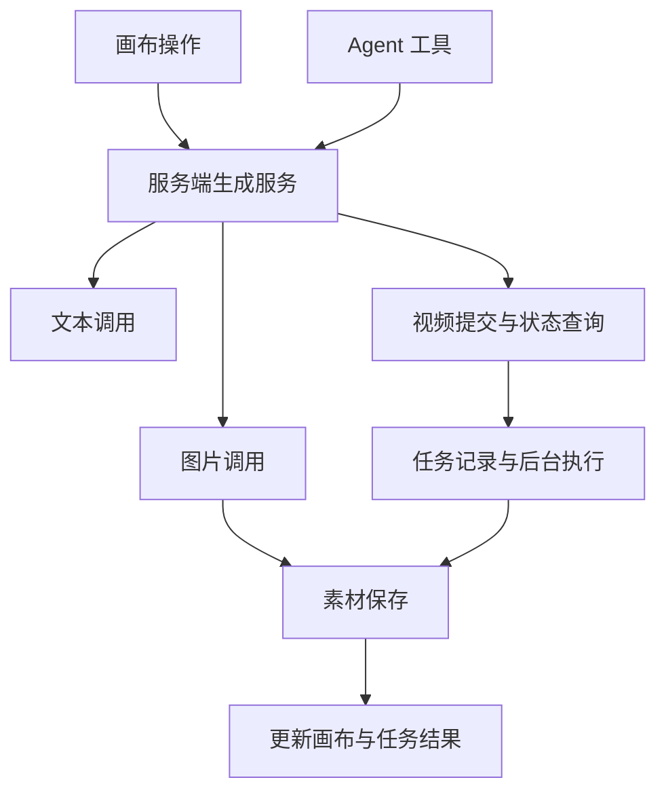

# AI 创作平台模型接入调研

调研日期：2026-09-15。目标：为类似 LibTV 的 weave.ai 平台选择文本、图片、视频模型接入方式。

本次下载官方仓库源码快照，追踪模型选择、适配器调用、视频提交与轮询、任务状态和素材保存。没有安装这些项目的依赖、启动应用或使用付费模型；以下为源码层面的能力与边界，不是运行验收。模型名称仅描述快照中的实现，不保证对应供应商今天仍提供相同版本和参数。

## 结论

这些项目采用三种主要方式：

1. **统一多模态 SDK + 供应商适配器**：OpenStory 使用 TanStack AI 的文本、图片、视频接口，底层连接 fal、OpenRouter 及厂商直连接口。
2. **文本 SDK + 自建媒体适配器**：火宝使用 Mastra / Vercel AI SDK 处理文本，自行实现图片、视频协议；Loomic 使用 LangChain 处理文本，自行实现图片、视频 Provider。
3. **可编程供应商脚本**：Toonflow 上游让供应商脚本导出文本、图片、视频函数，运行时加载配置与代码。

因此，视频接入需要独立的异步任务语义，但不意味着必须从零编写视频 SDK。**weave.ai 应先验证 TanStack AI 对首批目标模型的覆盖，再决定采用统一 SDK，还是保留 pi-ai 并补媒体适配。** TanStack AI 官方仍将视频生成标为实验功能，不能仅凭接口存在就确定选型。[视频接口文档](https://tanstack.com/ai/latest/docs/media/video-generation)

## 样本与快照

| 项目 | 调研提交 | 提交日期 | 当前许可证文件 | 主要参考价值 |
| --- | --- | --- | --- | --- |
| [OpenStory](https://github.com/openstory-so/openstory) | `bdcf8ef9240101bfcbfeea7fadc41ad461d4a9b8` | 2026-09-14 | [MIT](https://github.com/openstory-so/openstory/blob/bdcf8ef9240101bfcbfeea7fadc41ad461d4a9b8/LICENSE) | TanStack Start 项目中的多模态 SDK、持久化工作流、存储与计费 |
| [火宝短剧](https://github.com/chatfire-AI/huobao-drama) | `ff9b046f8950e16e131aa13b016c11269d9ed6ca` | 2026-09-11 | [CC BY-NC-SA 4.0](https://github.com/chatfire-AI/huobao-drama/blob/ff9b046f8950e16e131aa13b016c11269d9ed6ca/LICENSE) | 厂商协议适配和统一任务表 |
| [Toonflow 上游](https://github.com/HBAI-Ltd/Toonflow-app) | `e03cf590eb0cab63534a4040db9acb4ec95b42a6` | 2026-08-26 | [Apache-2.0](https://github.com/HBAI-Ltd/Toonflow-app/blob/e03cf590eb0cab63534a4040db9acb4ec95b42a6/LICENSE) | 可编程供应商、模型能力描述 |
| [Loomic](https://github.com/fancyboi999/Loomic) | `bdb47a5adf900b48615af0bd914336e3770021b5` | 2026-09-03 | [MIT](https://github.com/fancyboi999/Loomic/blob/bdb47a5adf900b48615af0bd914336e3770021b5/LICENSE) | Agent 调用生成工具、数据库队列、聚合服务适配 |

检索最初命中了 `yeluoge26/toonflow` 分支，但其提交停在 2026-03-25，且供应商结构与当前上游不同；本报告使用 HBAI-Ltd 上游，不将分支代码当成当前实现。许可证列只记录文件声明，不代表已经完成商业复用审查。

## 1. OpenStory：统一 SDK，但平台仍保留任务与路由职责

**文本**：`createAdapter()` 按模型及凭证路由到 TanStack AI 的 OpenRouter、Google、xAI 或 OpenAI-compatible 适配器；还支持经 fal 的 OpenRouter 代理。代码明确区分代理的 `Key` 鉴权与 OpenRouter 的 `Bearer` 鉴权。[文本适配器](https://github.com/openstory-so/openstory/blob/bdcf8ef9240101bfcbfeea7fadc41ad461d4a9b8/src/models/server/create-adapter.ts#L207)

**图片**：`generateImageWithProvider()` 调用 `@tanstack/ai` 的 `generateImage()`，根据路由选择 `falImage`、`createGeminiImage`、`createGrokImage` 或 BytePlus 适配器。平台仍负责模型参数转换与请求结果归一化。[图片调用](https://github.com/openstory-so/openstory/blob/bdcf8ef9240101bfcbfeea7fadc41ad461d4a9b8/src/stills/server/image-generation.ts#L101)

**视频**：提交和查询分开。`submitStudioVideoJob()` 返回 `jobId`、实际调用渠道 `via`、`endpointId` 等信息；随后 `pollStudioVideoJob()` 用提交时保存的渠道查询同一任务。fal 路径调用 `generateVideo({ adapter: falVideo(...) })` 和 `getVideoJobStatus(...)`。[提交](https://github.com/openstory-so/openstory/blob/bdcf8ef9240101bfcbfeea7fadc41ad461d4a9b8/src/studio/server/studio-video-generation.ts#L235)、[查询](https://github.com/openstory-so/openstory/blob/bdcf8ef9240101bfcbfeea7fadc41ad461d4a9b8/src/studio/server/studio-video-generation.ts#L656)

实际链路：

```text
创作请求 → Cloudflare Workflow
         → 确定实际渠道 → 提交视频任务 → 分批轮询
         → 计算费用 / 幂等扣费 → 转存 R2 → 写回素材结果
```

提交、轮询、扣费和上传分别放在 `step.do()` 中。扣费使用工作流实例派生的幂等键；这能说明应用扣费有去重设计，不能据此推断供应商生成请求具备 exactly-once 保证。[工作流](https://github.com/openstory-so/openstory/blob/bdcf8ef9240101bfcbfeea7fadc41ad461d4a9b8/src/studio/server/workflows/studio-generation-workflow.ts#L219)

最值得复用的设计是 **模型厂商与调用渠道分开**：同一个厂商的模型可经聚合服务或直连访问，后续轮询必须沿用原渠道，不能因用户修改密钥而重新路由。[MediaVia 定义](https://github.com/openstory-so/openstory/blob/bdcf8ef9240101bfcbfeea7fadc41ad461d4a9b8/src/models/via.ts)

对 weave.ai：优先参考其接入边界与任务分步，不需要直接照搬 Cloudflare 全套部署或整个计费系统。

## 2. 火宝短剧：文本走 SDK，媒体用请求构造器

**文本**：Mastra Agent 使用 Vercel AI SDK 的 `createOpenAI()`、`createGoogleGenerativeAI()` 创建模型，配置中包含模型名、API Key 与 Base URL。[文本模型构造](https://github.com/chatfire-AI/huobao-drama/blob/ff9b046f8950e16e131aa13b016c11269d9ed6ca/backend/src/agents/index.ts#L316)

**图片与视频**：分别维护注册表。图片包含 OpenAI、Gemini、Volcengine；视频包含 Volcengine、MiniMax、Aliyun。适配器负责构造请求、解析提交结果、构造查询请求、归一化查询状态。[注册表](https://github.com/chatfire-AI/huobao-drama/blob/ff9b046f8950e16e131aa13b016c11269d9ed6ca/backend/src/services/adapters/registry.ts)

协议差异由实际适配器处理，例如：

| 路径 | 快照中的请求处理 |
| --- | --- |
| OpenAI 图片 | 文生图走 `/images/generations`；带参考图走 `/images/edits`，构造 multipart 文件上传 |
| Gemini 图片 | 支持 `generateContent` 路径，解析图片的 `inlineData` / Base64 |
| Volcengine 视频 | 提交 `/contents/generations/tasks`，获取 ID 后查询任务 |
| Aliyun Wan 视频 | 构造 `input` 与 `parameters`，添加异步请求头，从 `output.task_id` 取任务 ID，再映射厂商状态 |

来源：[OpenAI 图片](https://github.com/chatfire-AI/huobao-drama/blob/ff9b046f8950e16e131aa13b016c11269d9ed6ca/backend/src/services/adapters/openai-image.ts)、[Gemini 图片](https://github.com/chatfire-AI/huobao-drama/blob/ff9b046f8950e16e131aa13b016c11269d9ed6ca/backend/src/services/adapters/gemini-image.ts)、[Volcengine 视频](https://github.com/chatfire-AI/huobao-drama/blob/ff9b046f8950e16e131aa13b016c11269d9ed6ca/backend/src/services/adapters/volcengine-video.ts)、[Wan 视频](https://github.com/chatfire-AI/huobao-drama/blob/ff9b046f8950e16e131aa13b016c11269d9ed6ca/backend/src/services/adapters/aliyun-wan-video.ts)。

实际链路：创建 `sysTask` → 后台 `processTask()` → 调用适配器 → 同步结果或 `pollTask()` → 下载到本地 → 更新任务和角色、场景、分镜记录。图片轮询配置为 5 秒一次，视频为 10 秒一次。[任务服务](https://github.com/chatfire-AI/huobao-drama/blob/ff9b046f8950e16e131aa13b016c11269d9ed6ca/backend/src/services/generation.ts#L149)

**重要边界**：有数据库任务记录，不等于能恢复执行。该项目在启动时把残留的 `processing` 任务统一标为失败，因为进程内轮询已经丢失；它没有沿用已保存的供应商任务 ID 恢复这些任务。[启动处理](https://github.com/chatfire-AI/huobao-drama/blob/ff9b046f8950e16e131aa13b016c11269d9ed6ca/backend/src/index.ts#L91)

对 weave.ai：请求构造与状态解析的边界适合参考；视频任务恢复应单独实现，避免用户重试时重复提交仍在上游执行的任务。

## 3. Toonflow 上游：供应商脚本本身是扩展单元

它不再只是按厂商名称切换固定函数。供应商代码放在 `data/vendor/*.ts` 模板及运行时供应商目录，配置与扩展模型列表在数据库中。`getVendorTemplateFn()` 解析 `vendorId:modelName`，读取脚本，用 Sucrase 转换 TypeScript，再通过运行环境取得导出的函数。[加载与调用](https://github.com/HBAI-Ltd/Toonflow-app/blob/e03cf590eb0cab63534a4040db9acb4ec95b42a6/src/utils/ai.ts#L118)、[脚本与模型列表](https://github.com/HBAI-Ltd/Toonflow-app/blob/e03cf590eb0cab63534a4040db9acb4ec95b42a6/src/utils/vendor.ts)

调用按能力分开：

- `textRequest()` 返回 Vercel AI SDK 的语言模型，由上层 `generateText()` / `streamText()` 调用。
- `imageRequest()` / `videoRequest()` 执行厂商调用，向上返回 URL 或 Base64。
- 上层 `AiImage` / `AiVideo` 负责结果转换、任务记录和 `save()`。

例如 Volcengine 脚本直接调用图片生成和视频任务接口；Kling 脚本自行生成鉴权 Token，POST 提交，再用注入的 `pollTask()` 查询，完成后转换结果。[Volcengine 脚本](https://github.com/HBAI-Ltd/Toonflow-app/blob/e03cf590eb0cab63534a4040db9acb4ec95b42a6/data/vendor/volcengine.ts#L324)、[Kling 提交与轮询](https://github.com/HBAI-Ltd/Toonflow-app/blob/e03cf590eb0cab63534a4040db9acb4ec95b42a6/data/vendor/klingai.ts#L368)

一个容易误读的地方：要求导出三类函数，不表示每个供应商都实现了三类能力。此快照的 `openai.ts` 中，图片和视频函数返回空字符串；文本函数才有实际实现。[OpenAI 模板](https://github.com/HBAI-Ltd/Toonflow-app/blob/e03cf590eb0cab63534a4040db9acb4ec95b42a6/data/vendor/openai.ts#L139)

工作台生成视频时，先写 `o_video` 并响应 ID，再在当前进程继续生成、保存和更新状态。Kling 的供应商任务 ID 留在脚本的局部调用中，公共 `AiVideo` 接口返回最终结果；这条链路本身没有暴露可独立恢复的提交 / 查询契约。[工作台入口](https://github.com/HBAI-Ltd/Toonflow-app/blob/e03cf590eb0cab63534a4040db9acb4ec95b42a6/src/routes/production/workbench/generateVideo.ts)、[轮询辅助函数](https://github.com/HBAI-Ltd/Toonflow-app/blob/e03cf590eb0cab63534a4040db9acb4ec95b42a6/src/utils/vm.ts#L90)

对 weave.ai：值得借鉴模型能力描述，包括生成模式、参考素材数量、时长与分辨率组合。首版没有运营人员在线编写适配器的明确需求时，不必先建设运行时脚本系统。

## 4. Loomic：Agent、生成 Provider、数据库队列分开

**文本**：Agent 通过 LangChain 的 `ChatOpenAI`、`ChatGoogleGenerativeAI` 等模型实现调用。[Agent 模型](https://github.com/fancyboi999/Loomic/blob/bdb47a5adf900b48615af0bd914336e3770021b5/apps/server/src/agent/deep-agent.ts#L169)

**图片与视频**：使用各自的 Provider 注册表和 `generate(params)` 接口。启动时根据密钥注册 Replicate、Google、Vertex、OpenAI 图片、Volces 图片等实现。[Provider 注册](https://github.com/fancyboi999/Loomic/blob/bdb47a5adf900b48615af0bd914336e3770021b5/apps/server/src/generation/providers/register-all.ts#L27)、[能力类型](https://github.com/fancyboi999/Loomic/blob/bdb47a5adf900b48615af0bd914336e3770021b5/apps/server/src/generation/types.ts)

**聚合服务仍需要参数适配**：Replicate 视频实现并非只替换模型名。它在 `buildModelInput()` 中按模型映射 `image` / `image_url`、数值或字符串时长、不同的音频开关；Wan 按是否有输入图片选择 T2V / I2V endpoint。随后 POST `/models/{endpoint}/predictions`，等待未完成时再查询 prediction。[Replicate 实现](https://github.com/fancyboi999/Loomic/blob/bdb47a5adf900b48615af0bd914336e3770021b5/apps/server/src/generation/providers/replicate-video.ts#L122)

实际链路：

```text
Agent 工具 / API → background_jobs + PGMQ
                → Worker → VideoProvider.generate()
                → 下载供应商结果 → Supabase Storage
                → asset_objects → 任务结果
```

视频执行器定期续租队列消息的可见性超时，避免长任务执行期间被再次取走；Worker 区分不可重试错误和可重试失败。[任务服务](https://github.com/fancyboi999/Loomic/blob/bdb47a5adf900b48615af0bd914336e3770021b5/apps/server/src/features/jobs/job-service.ts)、[视频执行器](https://github.com/fancyboi999/Loomic/blob/bdb47a5adf900b48615af0bd914336e3770021b5/apps/server/src/features/jobs/executors/video-generation.ts#L5)、[Worker](https://github.com/fancyboi999/Loomic/blob/bdb47a5adf900b48615af0bd914336e3770021b5/apps/server/src/worker.ts#L178)

**重要边界**：持久化队列可重新执行应用任务，但当前 Replicate 路径把 prediction ID 保留在一次 `generate()` 内，执行器只接收最终视频。根据这条调用链推断，进程中断后的重新执行可能重新提交生成，不能把队列重试等同于恢复原供应商任务。

对 weave.ai：参考 Agent 与人工生成共用后台服务、任务关联画布、结果转存的设计；让供应商任务 ID 尽早持久化，而不是藏在长时间等待的函数内部。

## 对 weave.ai 的建议

### 接入方案先按首批模型验证

| 条件 | 优先验证的方案 |
| --- | --- |
| 主要诉求是统一文本、生图、生视频调用 | TanStack AI + 已有适配器；以 OpenStory 为参考 |
| 明确需要 Pi 的模型或 Agent 生态 | pi-ai 负责文本；图片按其实际支持范围选用；视频接现成媒体 SDK 或少量厂商适配器 |
| 目标供应商不在所选 SDK 覆盖范围 | 针对该供应商补请求构造、提交、状态查询与结果解析 |

TanStack Start 与 TanStack AI 是不同层的选择；使用前者不强制使用后者。这里把 TanStack AI 列为首选验证对象，是因为源码和官方文档都显示它已有需要的多模态接口，而不是仅因名称或技术栈一致。[fal 适配器](https://tanstack.com/ai/latest/docs/adapters/fal)、[BytePlus 适配器](https://tanstack.com/ai/latest/docs/adapters/byteplus)

### 统一平台业务，保留能力差异



首版需要把这些信息记录清楚：

- **模型能力**：文本 / 图片 / 视频、参考图 / 首尾帧 / 多参考、时长、比例、分辨率、音频支持。
- **实际调用信息**：供应商或聚合渠道、endpoint、模型 ID、凭证配置引用。模型厂商与实际渠道分开。
- **任务恢复信息**：应用任务 ID、供应商任务 ID、参数快照、当前状态、下次查询时间。供应商已接单后优先继续查询；响应不明确时先对账，避免盲目重新提交。
- **素材结果**：自己的存储位置、原始来源、MIME、尺寸、时长、关联画布节点。生成完成与转存完成分开，上传失败不必重新生成。
- **费用记录**：应用请求与生成任务关联，区分用户余额扣费去重和上游请求去重；有供应商任务 ID 不代表提交天然幂等。

这些是平台必须负责的业务状态，不应依赖聊天 SDK 的临时消息或前端页面生命周期。密钥解析和供应商请求放在服务端。

下一步最有价值的是选定首批模型，做一条“文本生成分镜 → 生图 → 图生视频 → 结果转存”的小型验证，同时验证一次服务重启后恢复查询。暂不建设通用插件市场、在线适配器编程和复杂自动跨供应商切换。
